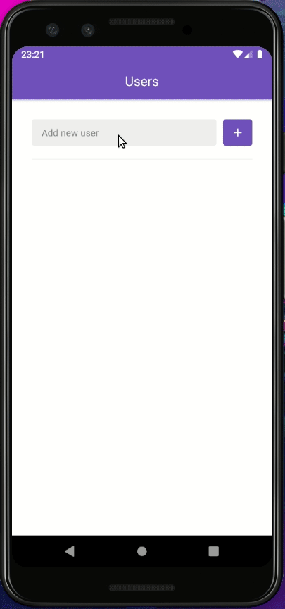

<h1> App GitHub - Preview </h1>

Este foi meu primeiro aplicativo,feito em React-Native, com fins de estudo, realizado junto ao bootcamp da RocketSeat.

A idéia do aplicativo é, adicionar novos repositórios, buscar repositórios favoritos, e listar o conteúdo do mesmo.

- Demonstração 
 

<b> O que utilizei ? </b>

- Layout;
- Debug com reactotron;
- Navegação;
- Configurações de Header da navegação;
- Configurações do eslint e prettier;
- LocalStorage;
- Chamadas http com axios;
- Infinit scroll;
- Pull to Refresh;
- WebView;
- Styled-Components para utilização de sintaxe em CSS que estamos acostumados.
